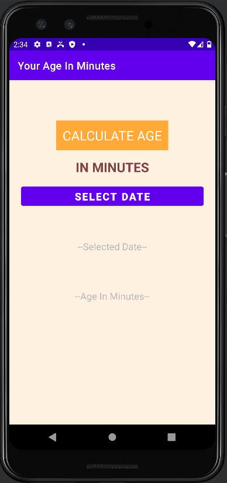
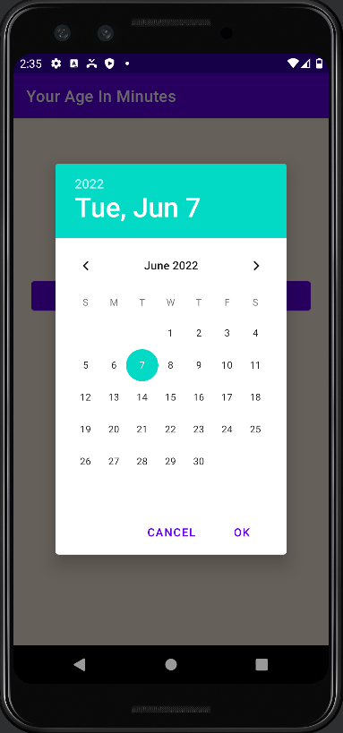
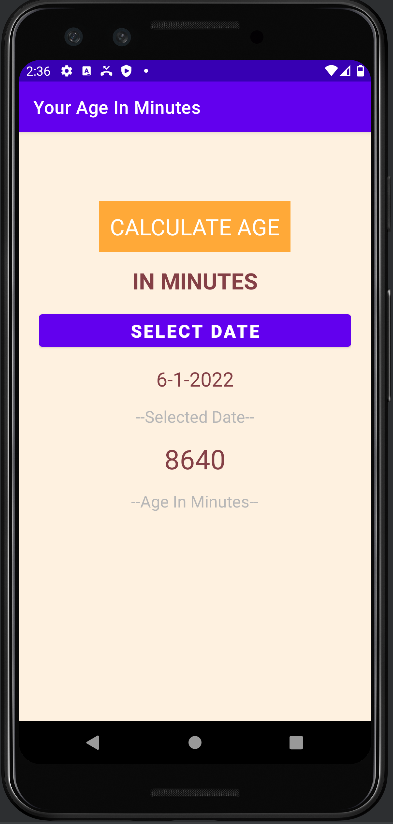

# AgeInMinutes
## App Preview
<table>
  <tr>
    <td align='center'>Main Page</td>
    <td align='center'>Date Selector</td>
    <td align='center'>Result Display</td>
  </tr>
  <tr>
    <td> </td>
    <td> </td>
    <td></td>
  </tr> 
</table>

## Description
This is a android app which calculates your age into minutes.
I built this app to get familiar with the mobile development with kotlin.

